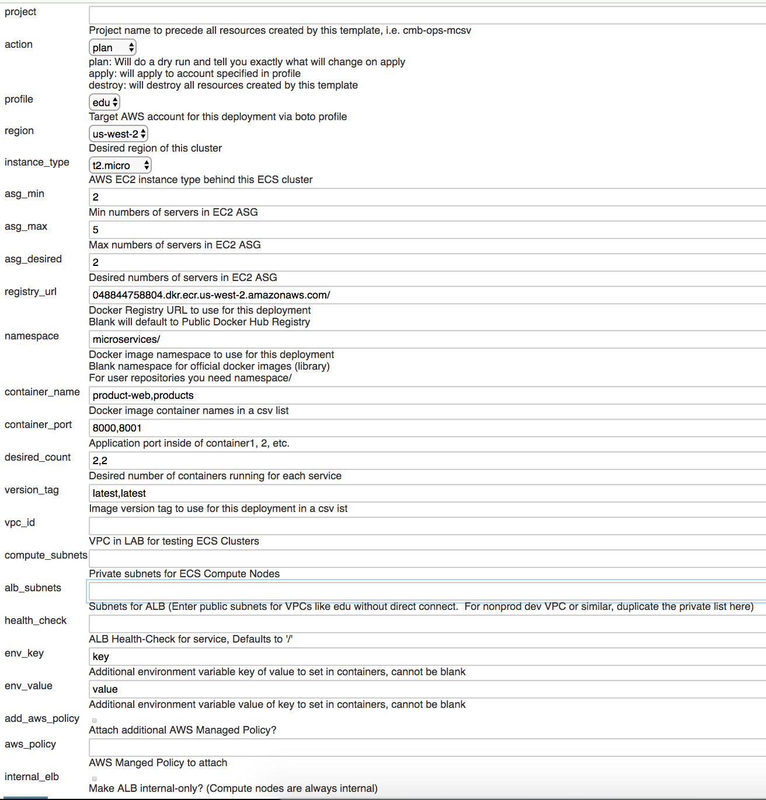

# Microservices on ECS

[](https://travis-ci.org/andymotta/ecs-alb-efs)   Terraform v0.11.7

This project was created to provide a pipeline for ECS cluster deployments at scale.  If you have microservices in containers that could benefit from ALB architecture, this template will be able to configure and deploy them, using the latest ECS-Optimized Amazon Linux AMIs to take advantage of IAM roles for tasks.

A few production-ready efforts are implemented:
- Compute/container nodes are in a private VPC (with NAT Gateway) where only ALB is publicly accessible.  ALB can be made private by setting the `internal_elb` var to true
- `add_aws_policy` will set IAM policy *at the container-level*, not at the instance-level
- A log group will be created for each ECS service you specify in the container vars, which are easily filtered in CloudWatch Logs
- Persistent storage is available out of the box with **EFS** which is available on the container's `/mnt`
  - EFS is now encrypted both at REST and at transit
- Upon deployment, the latest ECS-Optimized AMI will be used.  On update of the stack, releases of newer AMIs will not force new instances. (which can be disabled)
- **Protip**: Set `env_key` or `env_value` for *container* environment variables like DB endpoints.  The ALB endpoint is in all containers by default at $ENDPOINT.

## Quick-start
Default container image variables are set in `container_vars.tf` to deploy some example microservices.
### Get up and running...

If you're not using the `[default]` aws cli profile, make sure the correct profile in ~/.aws/(config|credentials) is configured in `aws_vars.tf`.
```
# provider.tf
provider "aws" {
  region = "${var.aws_region}"
  profile = "${var.profile}"
}

# vars.tf
variable "profile" {
  description = "Boto/AWS profile to use for this deployment"
  default = "edu"
}
```
The path is slightly different for *Windows*: https://www.terraform.io/docs/providers/aws/


### Planning Phase

Always run this first for syntax or logic check

`terraform init` is now required before running these commands the first time

```bash
ip="$(dig +short myip.opendns.com @resolver1.opendns.com)" && \
terraform plan \
	-var admin_cidr_ingress="${ip}/32" \
	-var key_name=aws_key_name
```

### Apply Phase

*key_name*: Key in AWS you would like to use to access your instances

```bash
terraform apply \
	-var admin_cidr_ingress="${ip}/32" \
	-var key_name=aws_key_name
```

Once the stack is created, **wait a minute or two** for positive health checks and test the stack by launching a browser with the ALB url.
- First service listed in container_name var will be available at / (i.e. product-web)
- Each subsequent service will be available at /container_name (i.e. /products)

### Destroy Phase :boom:

```bash
terraform destroy \
	-var admin_cidr_ingress="${ip}/32" \
	-var key_name={your_key_name}
```


## Architecture


Source: https://github.com/awslabs/ecs-refarch-cloudformation

### Rolling deployments

*deployment_minimum_healthy_percent* overrides a cli default of 100% a rolling deployment policy of 50% at a time.  When you update a task definition, check out the ALB target to see old connections draining.  Task Definition updates to any service are available almost immediately, thanks to the dynamic port mapping.  However, the previous task definition will continue running for a few minutes as it can take a while to drain connections and the previous task to disappear.

```
ec2-user@ip-10-10-0-197 ~ $ docker ps
CONTAINER ID        IMAGE                                                                           COMMAND             CREATED             STATUS              PORTS                        NAMES
a0982396ab51        048844758804.dkr.ecr.us-west-2.amazonaws.com/microservices/product-web:latest   "/app"              33 minutes ago      Up 33 minutes       0.0.0.0:32775->8000/tcp      MCSV-POC-product-web-bebfeacdf189b8c76600
4035e05cdfd3        048844758804.dkr.ecr.us-west-2.amazonaws.com/microservices/products:latest      "/app"              About an hour ago   Up About an hour    0.0.0.0:32768->8001/tcp      MCSV-POC-products-aeefddc3aaf080c2bc01
66cd74ae81cf        amazon/amazon-ecs-agent:latest
```


### ALB
The generated ALB Endpoint is set as an environment variable in each container, $ENDPOINT


Source: https://convox.com/blog/alb/

Health check are done via target groups for each container:


Source: https://aws.amazon.com/blogs/compute/microservice-delivery-with-amazon-ecs-and-application-load-balancers/

As pictured, they can all share a listener.  The health check looks for /target.

### EFS
`[Container's /mnt] >> [ EFS_mnt/container_name ]` #bestartwork

### Microservices
Examples borrowed from: https://github.com/awslabs/ecs-refarch-cloudformation/tree/master/services.  
Product web (2 containers) talks to a product api (2 containers) for products listing.  4 containers total running on only two ECS instances.

## Continuous Integration
For continuous delivery of this stack we can set up a Jenkins project that will check out this repository and add an execute shell step with a script like this:

### Jenkins Script
Until we can add a Jenkinsfile

```bash
rm -rf .terraform
bash -x tfstate/configure-remote-state.sh
echo "yes" | terraform ${action} \
  -var key_name=${key_name} \
  -var resource_tag=${project} \
  -var profile=${profile} \
  -var aws_region=${region} \
  -var instance_type=${instance_type} \
  -var asg_min=${asg_min} \
  -var asg_max=${asg_max} \
  -var asg_min=${asg_min} \
  -var asg_desired=${asg_desired} \
  -var admin_cidr_ingress=${admin_cidr_ingress} \
  -var registry_url=${registry_url} \
  -var namespace=${namespace} \
  -var container_name=${container_name} \
  -var container_port=${container_port} \
  -var desired_count=${desired_count} \
  -var version_tag=${version_tag} \
  -var health_check=${health_check} \
  -var env_key=${env_key} \
  -var env_value=${env_value} \
  -var add_aws_policy=${add_aws_policy} \
  -var aws_policy=${aws_policy} \
  -var internal_elb=${internal_elb}
```
Note that "Variables specified with the TF_VAR_ environment variables will be literal string values, just like -var."
So it's possible to clean up the script a bit with some expections
```bash
/usr/local/sbin/terraform init
/usr/local/sbin/terraform refresh \
  -var profile=${ACCOUNT} \
  -var add_aws_policy=${add_aws_policy} \
  -var aws_policy=${aws_policy}
echo "yes" | /usr/local/sbin/terraform ${action} \
  -var profile=${ACCOUNT} \
  -var add_aws_policy=${add_aws_policy} \
  -var aws_policy=${aws_policy}
  ```

'Build with parameters' would look similar to the following:
