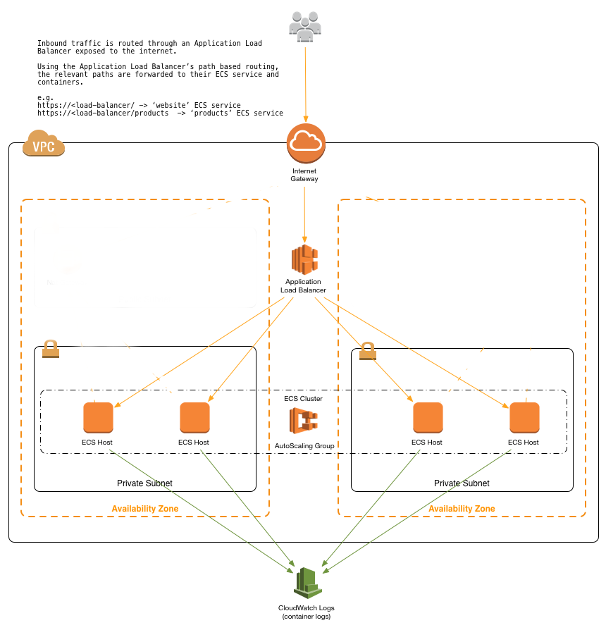
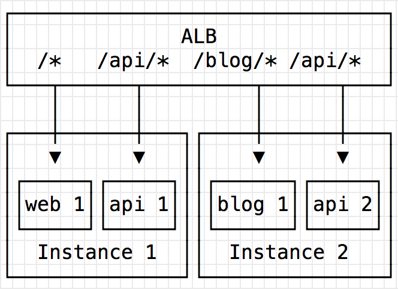
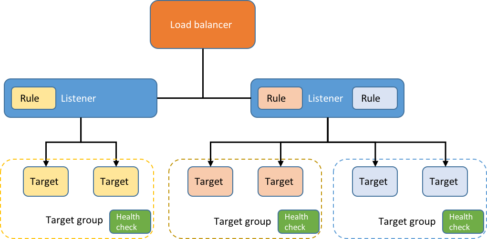

# Microservices on ECS POC

This POC launches ECS services fronted by Application Load Balancer that registers dynamic host ports and routes like an API Gateway.
Containers can find each other at <ALB_ENDPOINT>/api, which is where the health check lies-- No service discovery required.
It is also packaged with an EFS /mnt for persistent storage in each container, and creates log groups for each ECS service which are easily filtered in CloudWatch Logs.

The POC uses the latest CoreOS Stable AMIs.

To run, copy terraform.tfvars.editme to terraform.tfvars and add your IAM user for administering AWS.

## Architecture



Source: https://github.com/awslabs/ecs-refarch-cloudformation

### Rolling deployments

deployment_minimum_healthy_percent overrides a cli default of 100% a rolling deployment policy of 50% at a time.  When you update your task definition, check out the ALB target to see old connections draining.  Updates to the service are available almost immediately, especially thanks to the dynamic port mapping.  However, the previous task definition will continue running for a few minutes as it can take a while to drain connections and the previous task to disappear.


### ALB
The generated ALB Endpoint is set as an environment variable in each container, $ENDPOINT


Source: https://convox.com/blog/alb/

Health check are done via target groups for each container:


Source: https://aws.amazon.com/blogs/compute/microservice-delivery-with-amazon-ecs-and-application-load-balancers/

As pictured, they can all share a listener.  The health check looks for /target.


### EFS
`[Container's /mnt] >> [ EFS_mnt/container_name ]` #bestartwork

### Microservices
Examples borrowed from: https://github.com/awslabs/ecs-refarch-cloudformation/tree/master/services.  
Product web (2 containers) talks to a product api (2 containers) for products listing.  4 containers total running on only two ECS instances.

## Get up and running

**Planning phase**

Run this first for syntax or logic check!

```
ip=$(curl -s https://4.ifcfg.me/) && \
terraform plan \
	-var admin_cidr_ingress="${ip}/32" \
	-var key_name={your_key_name}
```

**Apply phase**

Please use your existing aws key-pair key you have access to in place of *your_key_name*.  This will be the key you use to log into instances

```
terraform apply \
	-var admin_cidr_ingress="${ip}/32" \
	-var key_name={your_key_name}
```

Once the stack is created, **wait for a few minutes** for the positive health checks and test the stack by launching a browser with the ALB url.
- First service listed in container_name var will be available at / (i.e. product-web)
- Each subsequent service will be available at /container_name (i.e. /products)

## Destroy :boom:

```
terraform destroy \
    -var admin_cidr_ingress='"0.0.0.0/0"' \
    -var key_name=dummykey
```
